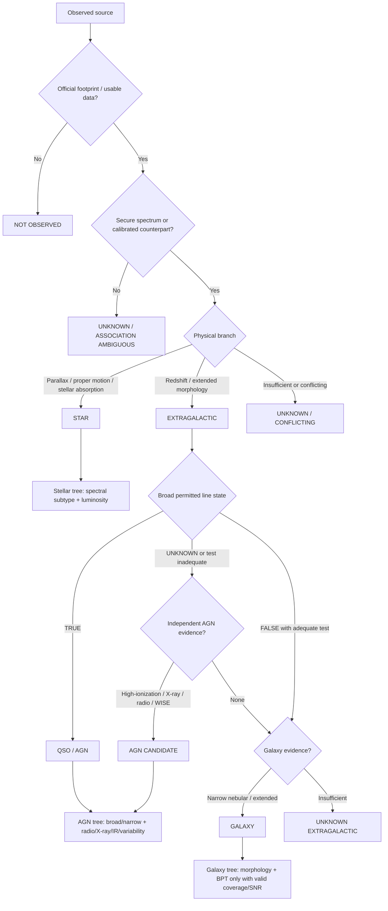

# Finding_objects

Finding astronomically interesting objects in large public survey datasets.

## Goals

1. Identify scientifically interesting astronomical sources.
2. Retrieve astronomical image data and analyse detected sources.
3. Record, classify, and preserve candidates for reproducible follow-up.

## MVP pipeline

The first version accepts an ICRS sky position (RA, Dec), downloads a FITS cutout from the DESI Legacy Surveys viewer, detects sources, converts detections to sky coordinates with WCS, cross-matches them against Gaia DR3, assigns operational candidate labels, and saves a CSV catalogue.

The labels are **triage labels, not astrophysical classifications**. Any candidate must be checked for image artifacts, masks, other bands/epochs, and external catalogues before scientific interpretation.

## Layout

- `src/finding_objects/` — pipeline and CLI
- `data/raw/` — downloaded FITS files
- `data/processed/` — intermediate products
- `data/candidates/` — candidate catalogues
- `results/` — small result summaries
- `config/` — example configuration

Generated data products are ignored by Git.

## Install

Python 3.11+ is recommended.

```bash
python -m venv .venv
source .venv/bin/activate
pip install -e .
```

## Run

```bash
finding-objects --ra 150.116321 --dec 2.205830 --size 256 --pixscale 0.262
```

The example coordinate is for testing the pipeline only and is not claimed to contain an interesting object.

## Candidate labels

- `gaia_matched` — detection positionally matched to Gaia DR3.
- `unmatched_source` — no Gaia match within the configured radius.
- `high_snr_unmatched` — unmatched source above the configured S/N threshold.
- `manual_review` — reserved for later human review.

## Next milestones

Multi-band photometry, survey mask/quality checks, additional catalogue cross-matches, repeated-epoch searches, candidate thumbnails, SQLite/Parquet storage, and anomaly scoring.

## Hierarchical decision-tree classification

The classifier uses separate **identity** and **characterization** trees. Every node records evidence, counter-evidence, missing decisive observations, and supports TRUE/FALSE/UNKNOWN/CONFLICTING states. Missing coverage is never treated as a non-detection.



Detailed design: [Decision-tree classification](docs/DECISION_TREE_CLASSIFICATION.md).
